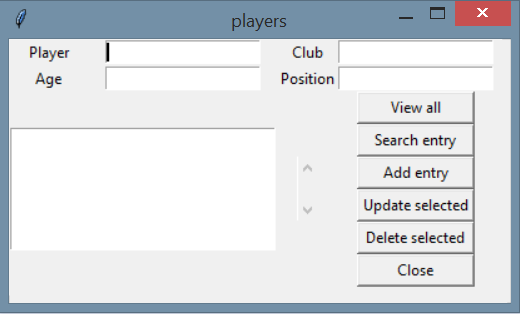
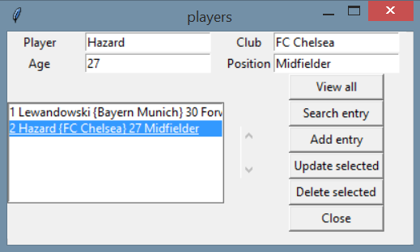

# Database application

## Table of contents
* [General info](#general-info)
* [Screenshots](#screenshots)
* [Technologies](#technologies)

## General info
This project containts both front-end and back-end code for a footballers app with graphic layout built with Tkinter library. In this app, you can check name, age, position and club where footballer plays.
I use Python and MySQL.

## Screenshots

## Technologies
* Python
* MySQL
